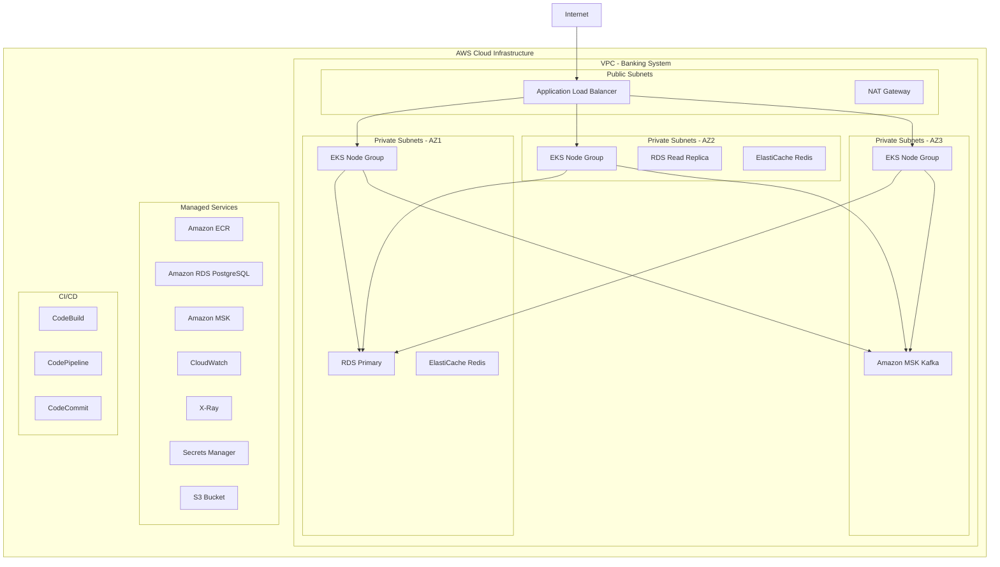
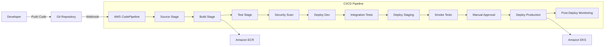

# ☁️ Banking System - Cloud Deployment Guide

## Overview

This document outlines the complete cloud deployment strategy for the Banking System, including AWS infrastructure design, CI/CD pipeline implementation, and deployment strategies to minimize customer impact during releases.

## 🏗️ AWS Cloud Architecture

### Infrastructure Components



### Core AWS Services

#### 1. **Amazon EKS (Elastic Kubernetes Service)**
- **Purpose**: Container orchestration and application deployment
- **Configuration**: Multi-AZ deployment with auto-scaling
- **Node Groups**: 
  - **Production**: 3-15 nodes (t3.large)
  - **Staging**: 2-6 nodes (t3.medium)
  - **Development**: 1-3 nodes (t3.small)

```yaml
# eks-cluster.yaml
apiVersion: eksctl.io/v1alpha5
kind: ClusterConfig

metadata:
  name: banking-system-cluster
  region: us-east-1
  version: "1.28"

vpc:
  cidr: "10.0.0.0/16"
  enableDnsHostnames: true
  enableDnsSupport: true

nodeGroups:
  - name: banking-app-nodes
    instanceType: t3.large
    minSize: 3
    maxSize: 15
    desiredCapacity: 6
    privateNetworking: true
    availabilityZones: ["us-east-1a", "us-east-1b", "us-east-1c"]
    
    iam:
      withAddonPolicies:
        imageBuilder: true
        cloudWatch: true
        ebs: true
        
    tags:
      Environment: production
      Application: banking-system
```

#### 2. **Amazon RDS PostgreSQL**
- **Purpose**: Primary database with read replicas
- **Configuration**: Multi-AZ deployment with automatic failover
- **Instance Type**: db.r6g.xlarge (Production), db.t4g.large (Staging)

```yaml
# rds-configuration.yaml
RDS:
  Engine: postgres
  EngineVersion: "15.4"
  InstanceClass: db.r6g.xlarge
  MultiAZ: true
  StorageType: gp3
  AllocatedStorage: 500
  StorageEncrypted: true
  BackupRetentionPeriod: 30
  
  ReadReplicas:
    - InstanceClass: db.r6g.large
      AvailabilityZone: us-east-1b
    - InstanceClass: db.r6g.large
      AvailabilityZone: us-east-1c
      
  SecurityGroups:
    - banking-db-sg
    
  Parameters:
    shared_preload_libraries: pg_stat_statements
    log_statement: all
    log_min_duration_statement: 1000
```

#### 3. **Amazon MSK (Managed Streaming for Kafka)**
- **Purpose**: Event streaming and async processing
- **Configuration**: 3-broker cluster across multiple AZs

```yaml
# msk-configuration.yaml
MSK:
  ClusterName: banking-kafka-cluster
  KafkaVersion: "2.8.1"
  NumberOfBrokerNodes: 3
  InstanceType: kafka.m5.large
  
  BrokerNodeGroupInfo:
    SecurityGroups:
      - banking-kafka-sg
    StorageInfo:
      EBSStorageInfo:
        VolumeSize: 100
        
  EncryptionInfo:
    EncryptionInTransit:
      ClientBroker: TLS
      InCluster: true
      
  Topics:
    - banking.account.create
    - banking.transaction.credit
    - banking.transaction.debit
    - banking.notifications
    - banking.audit
```

#### 4. **Amazon ElastiCache Redis**
- **Purpose**: Caching layer for improved performance
- **Configuration**: Redis cluster mode with automatic failover

```yaml
# elasticache-configuration.yaml
ElastiCache:
  Engine: redis
  EngineVersion: "7.0"
  NodeType: cache.r6g.large
  NumCacheNodes: 3
  
  ReplicationGroupDescription: "Banking System Cache"
  
  SecurityGroupIds:
    - banking-cache-sg
    
  SubnetGroupName: banking-cache-subnet-group
  
  Parameters:
    maxmemory-policy: allkeys-lru
    timeout: 300
```

### Security Configuration

#### VPC and Network Security
```yaml
# vpc-configuration.yaml
VPC:
  CIDR: "10.0.0.0/16"
  
  PublicSubnets:
    - "10.0.1.0/24"  # us-east-1a
    - "10.0.2.0/24"  # us-east-1b
    
  PrivateSubnets:
    - "10.0.10.0/24" # us-east-1a - App Tier
    - "10.0.11.0/24" # us-east-1b - App Tier
    - "10.0.12.0/24" # us-east-1c - App Tier
    - "10.0.20.0/24" # us-east-1a - Data Tier
    - "10.0.21.0/24" # us-east-1b - Data Tier
    - "10.0.22.0/24" # us-east-1c - Data Tier

SecurityGroups:
  ALB:
    Ingress:
      - Port: 443
        Protocol: HTTPS
        Source: 0.0.0.0/0
      - Port: 80
        Protocol: HTTP
        Source: 0.0.0.0/0
        
  EKS:
    Ingress:
      - Port: 8080
        Protocol: HTTP
        Source: ALB Security Group
      - Port: 8083
        Protocol: HTTP
        Source: ALB Security Group
        
  RDS:
    Ingress:
      - Port: 5432
        Protocol: TCP
        Source: EKS Security Group
        
  MSK:
    Ingress:
      - Port: 9092
        Protocol: TCP
        Source: EKS Security Group
      - Port: 2181
        Protocol: TCP
        Source: EKS Security Group
```

#### IAM Roles and Policies
```json
{
  "BankingSystemEKSServiceRole": {
    "AssumeRolePolicyDocument": {
      "Version": "2012-10-17",
      "Statement": [
        {
          "Effect": "Allow",
          "Principal": {
            "Service": "eks.amazonaws.com"
          },
          "Action": "sts:AssumeRole"
        }
      ]
    },
    "ManagedPolicyArns": [
      "arn:aws:iam::aws:policy/AmazonEKSClusterPolicy"
    ]
  },
  
  "BankingSystemNodeInstanceRole": {
    "AssumeRolePolicyDocument": {
      "Version": "2012-10-17",
      "Statement": [
        {
          "Effect": "Allow",
          "Principal": {
            "Service": "ec2.amazonaws.com"
          },
          "Action": "sts:AssumeRole"
        }
      ]
    },
    "ManagedPolicyArns": [
      "arn:aws:iam::aws:policy/AmazonEKSWorkerNodePolicy",
      "arn:aws:iam::aws:policy/AmazonEKS_CNI_Policy",
      "arn:aws:iam::aws:policy/AmazonEC2ContainerRegistryReadOnly",
      "arn:aws:iam::aws:policy/CloudWatchAgentServerPolicy"
    ]
  }
}
```

## 🚀 CI/CD Pipeline Architecture

### Pipeline Overview



### CodePipeline Configuration

```yaml
# codepipeline.yaml
AWSTemplateFormatVersion: '2010-09-09'
Description: 'Banking System CI/CD Pipeline'

Resources:
  BankingSystemPipeline:
    Type: AWS::CodePipeline::Pipeline
    Properties:
      Name: banking-system-pipeline
      RoleArn: !GetAtt CodePipelineServiceRole.Arn
      
      Stages:
        - Name: Source
          Actions:
            - Name: SourceAction
              ActionTypeId:
                Category: Source
                Owner: AWS
                Provider: CodeCommit
                Version: '1'
              Configuration:
                RepositoryName: banking-system-repo
                BranchName: main
              OutputArtifacts:
                - Name: SourceOutput
                
        - Name: Build
          Actions:
            - Name: BuildAction
              ActionTypeId:
                Category: Build
                Owner: AWS
                Provider: CodeBuild
                Version: '1'
              Configuration:
                ProjectName: !Ref BankingSystemBuildProject
              InputArtifacts:
                - Name: SourceOutput
              OutputArtifacts:
                - Name: BuildOutput
                
        - Name: Test
          Actions:
            - Name: UnitTest
              ActionTypeId:
                Category: Test
                Owner: AWS
                Provider: CodeBuild
                Version: '1'
              Configuration:
                ProjectName: !Ref BankingSystemTestProject
              InputArtifacts:
                - Name: BuildOutput
                
        - Name: SecurityScan
          Actions:
            - Name: SecurityScan
              ActionTypeId:
                Category: Invoke
                Owner: AWS
                Provider: Lambda
                Version: '1'
              Configuration:
                FunctionName: !Ref SecurityScanFunction
                
        - Name: DeployDev
          Actions:
            - Name: DeployToDev
              ActionTypeId:
                Category: Deploy
                Owner: AWS
                Provider: EKS
                Version: '1'
              Configuration:
                ClusterName: banking-system-dev
                ServiceName: banking-app
              InputArtifacts:
                - Name: BuildOutput
                
        - Name: IntegrationTest
          Actions:
            - Name: IntegrationTest
              ActionTypeId:
                Category: Test
                Owner: AWS
                Provider: CodeBuild
                Version: '1'
              Configuration:
                ProjectName: !Ref IntegrationTestProject
                
        - Name: DeployStaging
          Actions:
            - Name: DeployToStaging
              ActionTypeId:
                Category: Deploy
                Owner: AWS
                Provider: EKS
                Version: '1'
              Configuration:
                ClusterName: banking-system-staging
                ServiceName: banking-app
                
        - Name: ManualApproval
          Actions:
            - Name: ManualApproval
              ActionTypeId:
                Category: Approval
                Owner: AWS
                Provider: Manual
                Version: '1'
              Configuration:
                CustomData: 'Please review staging deployment and approve production release'
                
        - Name: DeployProduction
          Actions:
            - Name: BlueGreenDeploy
              ActionTypeId:
                Category: Deploy
                Owner: AWS
                Provider: EKS
                Version: '1'
              Configuration:
                ClusterName: banking-system-production
                ServiceName: banking-app
                DeploymentStrategy: BlueGreen
```

### CodeBuild Projects

#### Build Project
```yaml
# codebuild-build.yaml
version: 0.2

phases:
  pre_build:
    commands:
      - echo Logging in to Amazon ECR...
      - aws ecr get-login-password --region $AWS_DEFAULT_REGION | docker login --username AWS --password-stdin $AWS_ACCOUNT_ID.dkr.ecr.$AWS_DEFAULT_REGION.amazonaws.com
      - REPOSITORY_URI=$AWS_ACCOUNT_ID.dkr.ecr.$AWS_DEFAULT_REGION.amazonaws.com/$IMAGE_REPO_NAME
      - COMMIT_HASH=$(echo $CODEBUILD_RESOLVED_SOURCE_VERSION | cut -c 1-7)
      - IMAGE_TAG=${COMMIT_HASH:=latest}
      
  build:
    commands:
      - echo Build started on `date`
      - echo Building the Docker image...
      - mvn clean package -DskipTests
      - docker build -t $IMAGE_REPO_NAME:$IMAGE_TAG .
      - docker tag $IMAGE_REPO_NAME:$IMAGE_TAG $REPOSITORY_URI:$IMAGE_TAG
      - docker tag $IMAGE_REPO_NAME:$IMAGE_TAG $REPOSITORY_URI:latest
      
  post_build:
    commands:
      - echo Build completed on `date`
      - echo Pushing the Docker image...
      - docker push $REPOSITORY_URI:$IMAGE_TAG
      - docker push $REPOSITORY_URI:latest
      - echo Writing image definitions file...
      - printf '[{"name":"banking-app","imageUri":"%s"}]' $REPOSITORY_URI:$IMAGE_TAG > imagedefinitions.json
      
artifacts:
  files:
    - imagedefinitions.json
    - k8s-manifests/**/*
```

#### Test Project
```yaml
# codebuild-test.yaml
version: 0.2

phases:
  pre_build:
    commands:
      - echo Starting test environment setup...
      - docker run -d --name test-postgres -e POSTGRES_PASSWORD=test -p 5432:5432 postgres:15
      - docker run -d --name test-kafka -p 9092:9092 confluentinc/cp-kafka:7.4.0
      - sleep 30
      
  build:
    commands:
      - echo Running unit tests...
      - mvn test
      - echo Running integration tests...
      - mvn verify -Pintegration-tests
      - echo Running security tests...
      - mvn dependency-check:check
      - echo Running code quality analysis...
      - mvn sonar:sonar -Dsonar.projectKey=banking-system
      
  post_build:
    commands:
      - echo Test phase completed on `date`
      - docker stop test-postgres test-kafka
      - docker rm test-postgres test-kafka
      
reports:
  JUnitReports:
    files:
      - target/surefire-reports/**/*.xml
      - target/failsafe-reports/**/*.xml
    file-format: JUNITXML
    
  CodeCoverage:
    files:
      - target/site/jacoco/jacoco.xml
    file-format: JACOCOXML
```

## 🔄 Deployment Strategies

### 1. Blue-Green Deployment

**Implementation**: Zero-downtime deployment using Kubernetes Blue-Green strategy

```yaml
# blue-green-deployment.yaml
apiVersion: v1
kind: Service
metadata:
  name: banking-app-service
  labels:
    app: banking-app
spec:
  selector:
    app: banking-app
    version: blue  # Switch between 'blue' and 'green'
  ports:
    - port: 8080
      targetPort: 8080
  type: LoadBalancer

---
# Blue Deployment
apiVersion: apps/v1
kind: Deployment
metadata:
  name: banking-app-blue
  labels:
    app: banking-app
    version: blue
spec:
  replicas: 3
  selector:
    matchLabels:
      app: banking-app
      version: blue
  template:
    metadata:
      labels:
        app: banking-app
        version: blue
    spec:
      containers:
      - name: banking-app
        image: banking-system:blue
        ports:
        - containerPort: 8080
        livenessProbe:
          httpGet:
            path: /actuator/health
            port: 8080
          initialDelaySeconds: 120
          periodSeconds: 30
        readinessProbe:
          httpGet:
            path: /actuator/health/readiness
            port: 8080
          initialDelaySeconds: 60
          periodSeconds: 10

---
# Green Deployment
apiVersion: apps/v1
kind: Deployment
metadata:
  name: banking-app-green
  labels:
    app: banking-app
    version: green
spec:
  replicas: 3
  selector:
    matchLabels:
      app: banking-app
      version: green
  template:
    metadata:
      labels:
        app: banking-app
        version: green
    spec:
      containers:
      - name: banking-app
        image: banking-system:green
        ports:
        - containerPort: 8080
        livenessProbe:
          httpGet:
            path: /actuator/health
            port: 8080
          initialDelaySeconds: 120
          periodSeconds: 30
        readinessProbe:
          httpGet:
            path: /actuator/health/readiness
            port: 8080
          initialDelaySeconds: 60
          periodSeconds: 10
```

**Blue-Green Switch Script**:
```bash
#!/bin/bash
# blue-green-switch.sh

CURRENT_VERSION=$(kubectl get service banking-app-service -o jsonpath='{.spec.selector.version}')
NEW_VERSION="green"

if [ "$CURRENT_VERSION" = "green" ]; then
    NEW_VERSION="blue"
fi

echo "Switching from $CURRENT_VERSION to $NEW_VERSION"

# Update service selector
kubectl patch service banking-app-service -p '{"spec":{"selector":{"version":"'$NEW_VERSION'"}}}'

# Verify deployment health
echo "Waiting for health checks..."
sleep 60

# Check if new deployment is healthy
READY_REPLICAS=$(kubectl get deployment banking-app-$NEW_VERSION -o jsonpath='{.status.readyReplicas}')
DESIRED_REPLICAS=$(kubectl get deployment banking-app-$NEW_VERSION -o jsonpath='{.spec.replicas}')

if [ "$READY_REPLICAS" -eq "$DESIRED_REPLICAS" ]; then
    echo "Deployment successful. All $READY_REPLICAS replicas are ready."
    
    # Scale down old deployment
    kubectl scale deployment banking-app-$CURRENT_VERSION --replicas=0
    
    echo "Blue-Green deployment completed successfully!"
else
    echo "Deployment failed. Rolling back..."
    kubectl patch service banking-app-service -p '{"spec":{"selector":{"version":"'$CURRENT_VERSION'"}}}'
    exit 1
fi
```

### 2. Canary Deployment

**Implementation**: Gradual traffic shifting using Istio

```yaml
# canary-deployment.yaml
apiVersion: networking.istio.io/v1alpha3
kind: VirtualService
metadata:
  name: banking-app-canary
spec:
  hosts:
  - banking-app-service
  http:
  - match:
    - headers:
        canary:
          exact: "true"
    route:
    - destination:
        host: banking-app-service
        subset: canary
      weight: 100
  - route:
    - destination:
        host: banking-app-service
        subset: stable
      weight: 90  # 90% to stable
    - destination:
        host: banking-app-service
        subset: canary
      weight: 10  # 10% to canary

---
apiVersion: networking.istio.io/v1alpha3
kind: DestinationRule
metadata:
  name: banking-app-destination
spec:
  host: banking-app-service
  subsets:
  - name: stable
    labels:
      version: stable
  - name: canary
    labels:
      version: canary
```

**Canary Progression Script**:
```bash
#!/bin/bash
# canary-progression.sh

CANARY_PERCENTAGES=(10 25 50 75 100)
WAIT_TIME=300  # 5 minutes between each step

for percentage in "${CANARY_PERCENTAGES[@]}"; do
    stable_percentage=$((100 - percentage))
    
    echo "Setting canary traffic to ${percentage}%"
    
    # Update VirtualService
    kubectl patch virtualservice banking-app-canary --type='json' -p='[
        {
            "op": "replace",
            "path": "/spec/http/1/route/0/weight",
            "value": '$stable_percentage'
        },
        {
            "op": "replace", 
            "path": "/spec/http/1/route/1/weight",
            "value": '$percentage'
        }
    ]'
    
    # Monitor metrics for this step
    echo "Monitoring canary deployment for $WAIT_TIME seconds..."
    
    # Check error rate
    ERROR_RATE=$(curl -s "http://prometheus:9090/api/v1/query?query=rate(http_requests_total{job=\"banking-app\",status=~\"5..\"}[5m])" | jq -r '.data.result[0].value[1]')
    
    if (( $(echo "$ERROR_RATE > 0.01" | bc -l) )); then
        echo "High error rate detected: $ERROR_RATE. Rolling back..."
        ./rollback-canary.sh
        exit 1
    fi
    
    sleep $WAIT_TIME
done

echo "Canary deployment completed successfully!"
```

### 3. Rolling Deployment

**Implementation**: Kubernetes native rolling updates

```yaml
# rolling-deployment.yaml
apiVersion: apps/v1
kind: Deployment
metadata:
  name: banking-app-rolling
spec:
  replicas: 6
  strategy:
    type: RollingUpdate
    rollingUpdate:
      maxUnavailable: 1      # Maximum pods unavailable during update
      maxSurge: 2            # Maximum extra pods during update
  selector:
    matchLabels:
      app: banking-app
  template:
    metadata:
      labels:
        app: banking-app
    spec:
      containers:
      - name: banking-app
        image: banking-system:latest
        ports:
        - containerPort: 8080
        resources:
          requests:
            memory: "512Mi"
            cpu: "250m"
          limits:
            memory: "1Gi"
            cpu: "500m"
        livenessProbe:
          httpGet:
            path: /actuator/health/liveness
            port: 8080
          initialDelaySeconds: 120
          periodSeconds: 30
          timeoutSeconds: 10
          failureThreshold: 3
        readinessProbe:
          httpGet:
            path: /actuator/health/readiness
            port: 8080
          initialDelaySeconds: 60
          periodSeconds: 10
          timeoutSeconds: 5
          failureThreshold: 3
        env:
        - name: SPRING_PROFILES_ACTIVE
          value: "production"
        - name: DATABASE_URL
          valueFrom:
            secretKeyRef:
              name: banking-secrets
              key: database-url
```

## 🛡️ Risk Mitigation Strategies

### 1. Pre-Deployment Validation

```bash
#!/bin/bash
# pre-deployment-validation.sh

echo "Starting pre-deployment validation..."

# Database Migration Validation
echo "Validating database migrations..."
kubectl run migration-test --image=banking-system:latest --rm -it -- \
  mvn flyway:validate -Dflyway.url=$DATABASE_URL

if [ $? -ne 0 ]; then
    echo "Database migration validation failed!"
    exit 1
fi

# Configuration Validation
echo "Validating application configuration..."
kubectl run config-test --image=banking-system:latest --rm -it -- \
  java -jar app.jar --spring.profiles.active=production --validate-config

# Dependency Health Check
echo "Checking external dependencies..."
kubectl run dependency-check --image=banking-system:latest --rm -it -- \
  curl -f $KAFKA_HEALTH_URL && \
  curl -f $DATABASE_HEALTH_URL && \
  curl -f $REDIS_HEALTH_URL

echo "Pre-deployment validation completed successfully!"
```

### 2. Automated Rollback Mechanisms

```yaml
# automated-rollback.yaml
apiVersion: v1
kind: ConfigMap
metadata:
  name: rollback-config
data:
  rollback.sh: |
    #!/bin/bash
    
    # Automated rollback based on health metrics
    ERROR_THRESHOLD=0.05  # 5% error rate
    LATENCY_THRESHOLD=2000  # 2 seconds
    
    # Monitor deployment for 10 minutes
    for i in {1..20}; do
        # Check error rate
        ERROR_RATE=$(curl -s "http://prometheus:9090/api/v1/query?query=rate(http_requests_total{status=~\"5..\"}[5m])" | jq -r '.data.result[0].value[1]')
        
        # Check latency
        LATENCY_P95=$(curl -s "http://prometheus:9090/api/v1/query?query=histogram_quantile(0.95, rate(http_request_duration_seconds_bucket[5m]))" | jq -r '.data.result[0].value[1]')
        
        if (( $(echo "$ERROR_RATE > $ERROR_THRESHOLD" | bc -l) )) || (( $(echo "$LATENCY_P95 > $LATENCY_THRESHOLD" | bc -l) )); then
            echo "Performance degradation detected. Initiating rollback..."
            
            # Rollback to previous version
            kubectl rollout undo deployment/banking-app-rolling
            
            # Send alert
            curl -X POST "$SLACK_WEBHOOK" -d '{"text": "Automated rollback triggered due to performance degradation"}'
            
            exit 1
        fi
        
        echo "Health check $i/20 passed. Error rate: $ERROR_RATE, Latency P95: $LATENCY_P95"
        sleep 30
    done
    
    echo "Deployment monitoring completed. No issues detected."

---
apiVersion: batch/v1
kind: Job
metadata:
  name: deployment-monitor
spec:
  template:
    spec:
      containers:
      - name: monitor
        image: banking-system:monitoring
        command: ["/bin/bash", "/scripts/rollback.sh"]
        volumeMounts:
        - name: rollback-scripts
          mountPath: /scripts
      volumes:
      - name: rollback-scripts
        configMap:
          name: rollback-config
      restartPolicy: Never
```

### 3. Circuit Breaker Pattern

```java
// Enhanced Circuit Breaker for Deployment
@Component
public class DeploymentCircuitBreaker {
    
    private final CircuitBreaker circuitBreaker;
    private final MeterRegistry meterRegistry;
    
    public DeploymentCircuitBreaker(MeterRegistry meterRegistry) {
        this.meterRegistry = meterRegistry;
        this.circuitBreaker = CircuitBreaker.ofDefaults("deployment-protection");
        
        // Configure circuit breaker for deployment protection
        circuitBreaker.getEventPublisher()
            .onStateTransition(event -> {
                if (event.getStateTransition() == CircuitBreaker.StateTransition.CLOSED_TO_OPEN) {
                    // Trigger automated rollback
                    triggerEmergencyRollback("Circuit breaker opened during deployment");
                }
            });
    }
    
    @CircuitBreaker(name = "deployment-protection")
    public ResponseEntity<?> protectedOperation(Supplier<ResponseEntity<?>> operation) {
        return circuitBreaker.executeSupplier(operation);
    }
    
    private void triggerEmergencyRollback(String reason) {
        // Implement emergency rollback logic
        log.error("Emergency rollback triggered: {}", reason);
        
        // Send alerts
        alertingService.sendCriticalAlert(
            "Emergency Rollback", 
            "Deployment rollback triggered: " + reason
        );
        
        // Execute rollback
        deploymentService.emergencyRollback();
    }
}
```

### 4. Feature Flags for Safe Rollouts

```java
// Feature Flag Implementation
@Component
public class FeatureFlagService {
    
    @Value("${feature.new-transaction-engine.enabled:false}")
    private boolean newTransactionEngineEnabled;
    
    @Value("${feature.enhanced-validation.enabled:false}")
    private boolean enhancedValidationEnabled;
    
    public boolean isFeatureEnabled(String featureName, String userId) {
        switch (featureName) {
            case "new-transaction-engine":
                return newTransactionEngineEnabled && isUserInCanaryGroup(userId);
            case "enhanced-validation":
                return enhancedValidationEnabled;
            default:
                return false;
        }
    }
    
    private boolean isUserInCanaryGroup(String userId) {
        // Implement user-based feature rollout
        int hash = userId.hashCode();
        return (hash % 100) < getCanaryPercentage("new-transaction-engine");
    }
    
    private int getCanaryPercentage(String feature) {
        // Get canary percentage from configuration
        return configurationService.getCanaryPercentage(feature);
    }
}

// Usage in controllers
@RestController
public class TransactionController {
    
    @Autowired
    private FeatureFlagService featureFlagService;
    
    @PostMapping("/credit")
    public ResponseEntity<?> creditAccount(@RequestBody TransactionRequest request, 
                                         @RequestHeader("User-ID") String userId) {
        
        if (featureFlagService.isFeatureEnabled("new-transaction-engine", userId)) {
            return newTransactionEngine.processCredit(request);
        } else {
            return legacyTransactionEngine.processCredit(request);
        }
    }
}
```

### 5. Database Migration Safety

```sql
-- Safe Database Migration Strategy
-- migration-strategy.sql

-- Step 1: Add new column (backward compatible)
ALTER TABLE accounts ADD COLUMN new_balance_field DECIMAL(19,2);

-- Step 2: Populate new column with existing data
UPDATE accounts SET new_balance_field = balance WHERE new_balance_field IS NULL;

-- Step 3: Add constraint (in separate migration)
-- V2__add_balance_constraint.sql
ALTER TABLE accounts ALTER COLUMN new_balance_field SET NOT NULL;

-- Step 4: Update application to use new column (deploy application)

-- Step 5: Remove old column (in final migration, after application deployment)
-- V3__remove_old_balance.sql
ALTER TABLE accounts DROP COLUMN balance;
ALTER TABLE accounts RENAME COLUMN new_balance_field TO balance;
```

## 📊 Monitoring and Alerting

### CloudWatch Dashboards

```yaml
# cloudwatch-dashboard.yaml
AWSTemplateFormatVersion: '2010-09-09'
Resources:
  BankingSystemDashboard:
    Type: AWS::CloudWatch::Dashboard
    Properties:
      DashboardName: BankingSystemProduction
      DashboardBody: !Sub |
        {
          "widgets": [
            {
              "type": "metric",
              "properties": {
                "metrics": [
                  ["AWS/ApplicationELB", "RequestCount", "LoadBalancer", "banking-alb"],
                  ["AWS/ApplicationELB", "TargetResponseTime", "LoadBalancer", "banking-alb"],
                  ["AWS/ApplicationELB", "HTTPCode_Target_4XX_Count", "LoadBalancer", "banking-alb"],
                  ["AWS/ApplicationELB", "HTTPCode_Target_5XX_Count", "LoadBalancer", "banking-alb"]
                ],
                "period": 300,
                "stat": "Average",
                "region": "us-east-1",
                "title": "Application Load Balancer Metrics"
              }
            },
            {
              "type": "metric", 
              "properties": {
                "metrics": [
                  ["AWS/RDS", "CPUUtilization", "DBInstanceIdentifier", "banking-db"],
                  ["AWS/RDS", "DatabaseConnections", "DBInstanceIdentifier", "banking-db"],
                  ["AWS/RDS", "ReadLatency", "DBInstanceIdentifier", "banking-db"],
                  ["AWS/RDS", "WriteLatency", "DBInstanceIdentifier", "banking-db"]
                ],
                "period": 300,
                "stat": "Average", 
                "region": "us-east-1",
                "title": "RDS Database Metrics"
              }
            }
          ]
        }
```

### Alert Configuration

```yaml
# cloudwatch-alarms.yaml
HighErrorRateAlarm:
  Type: AWS::CloudWatch::Alarm
  Properties:
    AlarmName: BankingSystem-HighErrorRate
    AlarmDescription: High error rate detected
    MetricName: HTTPCode_Target_5XX_Count
    Namespace: AWS/ApplicationELB
    Statistic: Sum
    Period: 300
    EvaluationPeriods: 2
    Threshold: 10
    ComparisonOperator: GreaterThanThreshold
    AlarmActions:
      - !Ref SNSTopicArn
      
HighLatencyAlarm:
  Type: AWS::CloudWatch::Alarm  
  Properties:
    AlarmName: BankingSystem-HighLatency
    AlarmDescription: High response time detected
    MetricName: TargetResponseTime
    Namespace: AWS/ApplicationELB
    Statistic: Average
    Period: 300
    EvaluationPeriods: 3
    Threshold: 2.0
    ComparisonOperator: GreaterThanThreshold
    AlarmActions:
      - !Ref SNSTopicArn

DatabaseConnectionAlarm:
  Type: AWS::CloudWatch::Alarm
  Properties:
    AlarmName: BankingSystem-DatabaseConnections
    AlarmDescription: High database connection count
    MetricName: DatabaseConnections
    Namespace: AWS/RDS
    Statistic: Average
    Period: 300
    EvaluationPeriods: 2
    Threshold: 80
    ComparisonOperator: GreaterThanThreshold
    AlarmActions:
      - !Ref SNSTopicArn
```

## 🎯 Cost Optimization

### Resource Optimization
- **Spot Instances**: Use for development and testing environments
- **Reserved Instances**: RDS and EC2 for production workloads
- **Auto Scaling**: Horizontal pod autoscaling based on CPU and memory
- **Resource Limits**: Proper resource requests and limits in Kubernetes

### Estimated Monthly Costs (Production)

| Service | Configuration | Estimated Cost |
|---------|---------------|----------------|
| **EKS Cluster** | 1 cluster | $73 |
| **EC2 Instances** | 6 t3.large nodes | $622 |
| **RDS PostgreSQL** | db.r6g.xlarge + 2 read replicas | $847 |
| **Amazon MSK** | 3 kafka.m5.large brokers | $432 |
| **ElastiCache Redis** | 3 cache.r6g.large nodes | $456 |
| **Application Load Balancer** | 1 ALB | $23 |
| **Data Transfer** | 1TB/month | $90 |
| **CloudWatch** | Logs and metrics | $50 |
| **ECR** | Container images | $10 |
| **S3** | Backups and artifacts | $25 |
| **Total** | | **~$2,628/month** |

## 🚀 Getting Started

### 1. Infrastructure Deployment
```bash
# Deploy AWS infrastructure
./deploy-infrastructure.sh

# Deploy EKS cluster
eksctl create cluster -f eks-cluster.yaml

# Deploy applications
kubectl apply -f k8s-manifests/
```

### 2. Pipeline Setup
```bash
# Create CodeCommit repository
aws codecommit create-repository --repository-name banking-system-repo

# Deploy CI/CD pipeline
aws cloudformation deploy --template-file codepipeline.yaml --stack-name banking-pipeline

# Push code to trigger pipeline
git remote add origin https://git-codecommit.us-east-1.amazonaws.com/v1/repos/banking-system-repo
git push origin main
```

### 3. Monitoring Setup
```bash
# Deploy monitoring stack
kubectl apply -f monitoring/

# Configure dashboards
aws cloudformation deploy --template-file cloudwatch-dashboard.yaml --stack-name banking-monitoring
```

This comprehensive cloud deployment strategy ensures high availability, scalability, and minimal risk to customers during deployments while maintaining cost efficiency and operational excellence.